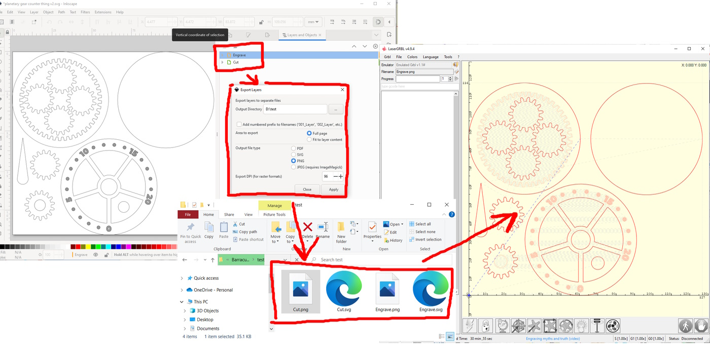

# Inkscape Export Layers

Inkscape extension to export layers as individual SVG, PNG, PDF or JPEG images.
I use this to separate out engraving and cut layers to send to <a href="www.lasergrbl.com">LaserGRBL</a>, although I'm sure it has other uses. 

This version works with Inkscape version 1.2. Note that, although there is a "batch export" function built into Inkscape, it automatically crops the exported files to the extent of features in that layer, which makes it unusable for this purpose. There is an open <a href="https://gitlab.com/inkscape/inbox/-/issues/6714">feature request</a> in the Inkscape queue to improve the batch export process but, until that gets implemented, feel free to use this extension to provide this functionality.

The code here heavily relies on previous work by github users: @jespino, @dmitry-t, and @dja001. Thankyou!

## How to use

1.  Download `export_layers.inx` and `export_layers.py` and place them in your Inkscape extensions folder (`C:\Users\username\AppData\Roaming\inkscape\extensions` on Windows, or `~/.config/inkscape/extensions/` on linux)
1. Open Inkscape
1. Go to `Extensions` > `Export` > `Export Layers...`
1. Follow instructions in pop-up dialog and set options for your export
1. Click `Apply`.
